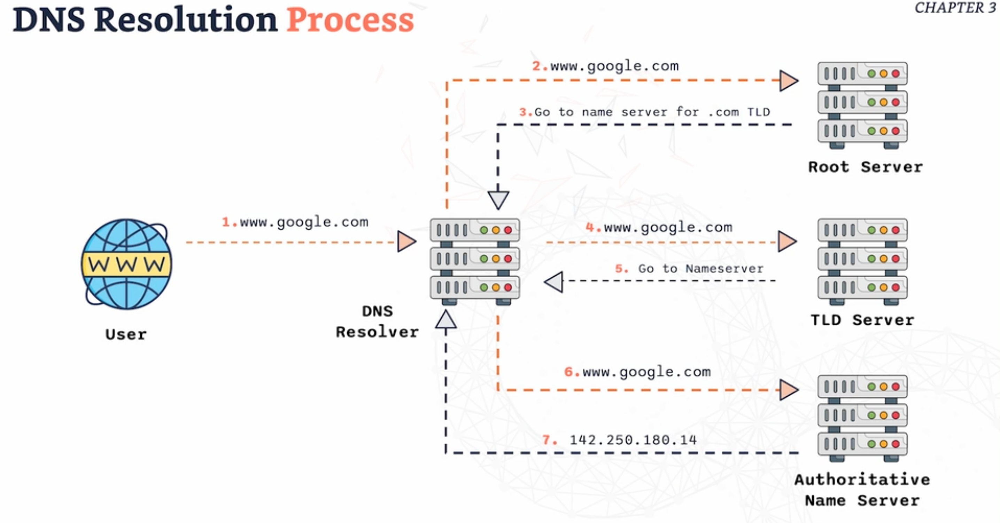
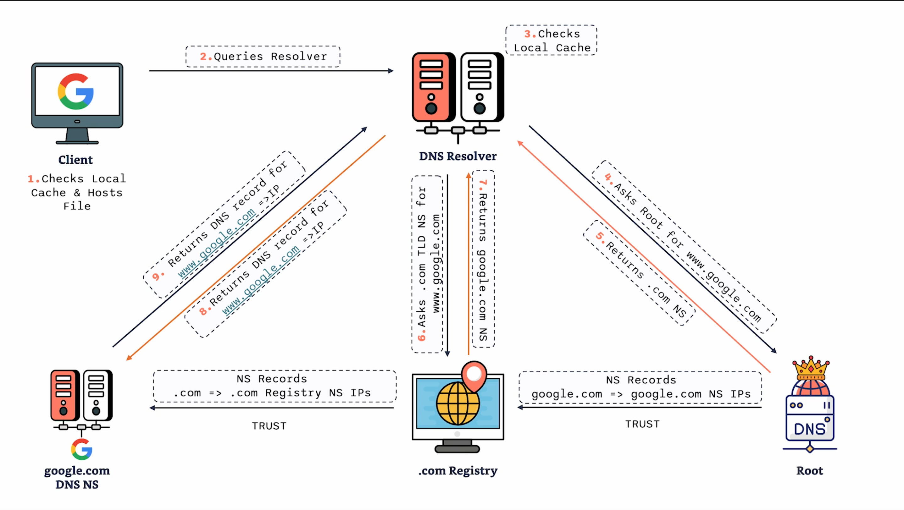

# Notes
## Intro to Networking Fundamentals 
A. Overview of computer netowrks and ther importance in modern infrastucture & Devops 

B. Network basics/Types of Networks -> LAN, WAN etc.

C. Key networking components -> Routers, Switches, Firewalls 

D. IP addressing (IPv4 & IPv6)

E. MAC addresses 

F: Ports and Protocols (TCP, UDP)

### A: Computer Networks 
- Definition -> connecting devices to share information
- Purpose -> Communication and resource sharing 
#### Core Types of Computer Networks
1. LAN (Local Area Network) e.g. Home Wi-Fi 
2. WAN (Wide Area Network) e.g. Internet 
#### Importance in modern infrastructure 
- Foundation -> enables communication between devices 
- Resource sharing -> facilitates sharing of files, printers and more 
- Internet Functionality -> critical for browsing, streaming and communication 
- Application support -> backbone of app connectivity and data transfer 
#### Networking in DevOps 
- Server Interaction -> Enables communication between servers and applications
- Deployment -> Critical for launching and updating applications 
- Management -> Crucial in monitoring and managing infrastructure 
- Optimisation -> Enhances troubleshooting, performance and scalability 
### B: Network basics/Types of Networks -> LAN, WAN etc.
#### Types of Networks 
1. LAN 
- - Small area, like a home or office 
- -  Commects devices and share resources 
2. WAN 
- - Large area, like a city, country or a larger region 
- - Connects multiple LANs 
### C. Key networking components -> Routers, Switches, Firewalls 
#### Switches, Routers and Firewall
Switches 

- Connect devices within the same network 
- Manage data flow within a LAN 

Routers 

- Direct traffic between networks 
- Connect different networks 

Firewalls 

- Protect networks from unauthorised access 
- Monitor and control incoming & outgoing network traffic 

### D. IP addressing (IPv4 & IPv6)

#### IP Addresses 

IP Addressing -> Unique identifiers for devices on a network

#### IPv4 
- 192.168.0.5 
- - 32-bit address 
- - Format -> four decimal numbers seperated by dots 

#### IPv6 
- 2001:0db8:85a3:0000:0000:8a2e:0390:7334
- - 128-bit address 
- - Format -> eight groups of four hexidecimal deigits seperated by colons 

- IP address -> stands for internet protocol address 
- IPv4 -> each group can vary from 0 to 255 and provides 4.3 billion unique addresses 
- With the rapid growth of the internet, IPv4 addresses are becoming scarce - that is why IPv6 comes in 
- IPv6 -> The transition is essential for the growth of the internet. Includes enhancements like simplfied address assignment and improved security features 
- IP addresses enables devices to identify and communicate with each other on the network. Without IP addresses, devices wouldn't know where to send or recieve data. 

### E. MAC addresses 

#### MAC Addresses 

MAC Addresses -> Unique identifiers assigned to network interfaces (Media Access Control Address)

Format 
- 48-bit address 
- Example: 00:1A:2B:3C:4D:5E

Function 
- Operates at the data link layer of the OSI model - data link layer is responsible for node to node transfer. 
- Facilitates device identification within a local network 

Importance 

- Essential for network communication and security 

### F: Ports and Protocols (TCP, UDP)
#### Ports & Protocols: TCP, UDP 

- What are ports? -> Logical endpoints for communication. Think of ports are logical doors on your device. Each door is numbered and each number is used for a specific type of network communication e.g. web traffic typically goes through port 80 (HTTP) and port 443 for HTTPS. These ports help facilitate communcation between devices. When your computer wants to send or rreceive  data is uses these ports to make sure that the data goes to the right place. 

- Definition of Protocols -> Rules governing data transmission. Rules of the road for data transmission. Common protocols include HTTP, FTP, SNTP and more. Protocols are languages devices use to talk to each other. 

- Importance -> Facilitates communication between devices. Without ports and protocols our device communication would be a mess. Ports make sure the data gets to the application and protocols makes sure data is understandble and properly formatted for smooth communication. 

#### Transmission Control Protocol (TCP)

- It is the postman of the internet. It ensures that data sent from one device reaches another device accuratley and in the correct order. It is a protocol which means there is a set of rules that is folllows. 

##### Characteristics of TCP 
1. Connection-oriented -> This means that before any data is sent, a connection is sent between two devices. A bit like a phone call, you need to dial and get connected first.

2. Requires a 'handshake' -> This is the process where the two devices agree to communication. Its like when two people handshake when they agree on something. In networking this handshake is a three step process to make sure that both devices are ready to send and rreceive  data. 

3. Reliable data transfer -> TCP makes sure that all data is sent correctly. If any data is lost or corrupted, TCP will send it. 

##### Functions of TCP 
1. Ensures data is delivered in order -> TCP make sure the data is delivered in the correct order. 
2. Error-checking and flow control -> this is to prevent congestion. 
3. Any bidirectional communication -> communication happens back and forth 

#### User Datagram Protocol (UDP)
- UDP is a simple protocol used to send and receive  data. Unlike TCP, UDP is connectionless. 

##### Characteristics of UDP 
1. Simple protocol to send and receive data.

2. Prior communication not required (can be a double-edged sword). Pro -> data can be sent immediatley without waiting for the connection to be established. Con -> there is no gurantee that the data will reach its destination 

3. Connectionless 

4. Fast but less reliable 

##### Functions of UDP 
1. Suitable for real-time applications (e.g. video streaming)

2. DNS 

3. VPN - Virtual private network 

##### TCP vs UDP 

<table>
<tr>
<th>Comparison</th>
<th>TCP</th>
<th>UDP</th>
</tr>
<tr>
<td>Connection</td>
<td>Connection -oriented</td>
<td>Connectionless</td>
</tr>
<td>Reliability</td>
<td>Reliable, ensures data delivery and order </td>
<td>Less reliable, no gurantee of deliver or order </td>
</tr>
<tr>
<td>Speed</td>
<td>Slower due to overhead of connection setup</td>
<td>Faster, no connection or handshake setup is required</td>
</tr>
<tr>
<td>Error - checking</td>
<td>Error-checking and flow control</td>
<td>No error-checking or flow control</td>
</tr>
<tr>
<td>Use-cases</td>
<td>Web browsing, email, file transfer</td>
<td>Video streaming, online gaming, DNS, VPN</td>
</tr>
</table>

## OSI Model 
#### The 7-layers of the OSI model 
#### Why do we need a communication model?
- Provides a standard framework that simplifies the way devices and applications communicate over a network. 
#### Application independence 
-  Without a standard model, applications must understand the underlying network 
- Imagine having different versions of your application/software for WiFi, Ethernet,Fiber etc. 
#### Simplified Network Equipment Managment 
- Upgrading network equipment is difficults without a standard model 
#### Decoupled innovation 
- Innovations can happen in each layer independently, without affecting the entire system 

#### 7 layers of Application 

Please Do Not Throw Sausage Pizza Away  - Acronym 

<table>
<tr>
<td>Application</td>
<td> -> End user layer

-> HTTP, FIP, IRC, SSH, DNS</td>
</tr>
<tr>
<td>Presentation</td>
<td>-> Syntax user layer

   -> SSL, SSH, IMAP, FTP, MPEG, JPEG</td>
</tr>
<tr>
<td>Session</td>
<td> -> Sync and send to port 

-> API's, Sockets, Winsock</td>
</tr>
<tr>
<td>Transport</td>
<td>-> End-to-end Connections 

-> TCP, UDP</td>
</tr>
<tr>
<td>Network</td>
<td>-> Packets

-> IP, ICMP, IPSec, IGMP</td>
</tr>
<tr>
<td>Data-link</td>
<td>-> Frames 

-> Ethernet, PPP, Switch, Bridge</td>
</tr>
<tr>
<td>Physical</td>
<td>-> Physical Structure

-> Coax, Fibre, Wireless, Hubs, Repeaters</td>
</tr>
</table>

#### Layer 1: Physical Layer 
- Function -> Transmits raw bit steam over a physical medium 
- Components -> Cables, Switches and Network interface cards 

-> This deals with the hardware connection including cables, switches and network interface cards. Physical medium can be copper that transmitts electric signals, fibre, light waves and wifi. There is no device addressing here -> that means that all data is processed by all devices. Think of it like shouting in a room without saying any names. This is the limitation at layer 1 and it is solved in Layer 2. 
#### Layer 2: Data Layer 
- Function -> This layer provides node-to-node data transfer and detects, possibly corrects, errors that may occure in the Physical Layer. It ensures that data is transferred correctly between adjacent network nodes. 
- Components -> Mac addresses, Switched and Bridges  
- Think of it as a traffic cop, that ensures data packets are sent and received correctly between differnt network nodes. Its all about maintaining a reliable network link between different devices. In layer 1 data is sent randomly and not in order. Layer 2 puts your data packets into frames where it is actually organised, like envelopes carrying the data to ensure it gets to the right place. 
#### Layer 3: Network Layer 
- Function -> Determines how data is sent to the recipient. Manages packet forwarding including routing through intermediate routers. 
- Components -> IP addresses, Routers 
- Decides the best path for data to travel. Data in this layer are organised in packets. Packets are like little parcels that carry data from one device to another. IP addresses handle where packets go to. Routers are components that allow it to do its job. 
#### Layer 4 Transport Layer 
- Function -> Provides reliable data transfer services to the upper layers. Segments and reassembles data. 
- Components -> TCP, UDP 
- Think of it like the delivery service that make sure your data packets arrive safely and in the right sequence.
#### Layer 5: Session Layer 
- Function -> Manages sessions between applications. Establishes, maintains and terminates connections
- Components -> Session management protocols 
- Establishing means getting a session started like when you login to a website for example. Maintaining means keeping the session alive ensuring that any conversions or requests can continue smoothly. Terminating would be closing any session e.g. logging out or closing the browser 
#### Layer 6: Presentation Layer 
- Function -> Translates data between the application later and the network. Ensures that data is in a usable format 
- Components -> Encryption, data formatting 
- Sometimes known as the syntax layer. Why? Because it ensures that the data being sent is in a readble and usable format. Think of it like a translator that converts your data into a format that the application layer (layer 7) can understand. Encryption is for security. 
#### Layer 7: Application Layer 
- Function -> Provides network services directly to applications. End-user layer 
- Components -> HTTP, FTP, SMTP
- It is the top layer of the OSI model. Everything happens that you the user can interact with. FTP is when your are transferring files between different servers generally. SMTP is being used when sending emails. 

#### TCP/IP Model: A commonly used model
1. Application Layer -> HTTP, TLS, DNS 
2. Transport Layer -> TCP, UDP 
3. Internet Later -> IP 
4. Network Access Layer -> Ethernet, Wireless LAN 

#### OSI Layers: POV of sender & receiver 
##### POV of Sender 
"User sends a POST request to an HTTP web page
1. Layer 7 - Application -> POST request with JSON data to the HTTPS server 
2. Layer 6 - Presentation -> Serialise JSON to flat byte data strings 
3. Layer 5 - Session -> Request to esablish TCP connection/TLS
4. Layer 4 - Transport -> Sends SYN request to target port 443 which is HTTPS 
5. Layer 3 - Network -> SYN in an IP packets and add the source/destination IP 
6. Layer 2 - Data Link Layer -> Each packet goes into a single frame and adds the source/destination MAC addresses 
7. Layer 1 - Physical -> Eac hframe become string of bits which is converted into wither a radio signal (Wi-Fi), electrical signal (Ethernet), or light (Fibre)
##### POV of Receiver
"User sends a POST request to an HTTP web page"
1. Layer 1 - Physical -> Radio, electric or light is recieved and converted into digital bits 
2. Layer 2 - Data Link -> the bits from layer 1 is assembled into frame 
3. Layer 3 - Network -> The frame forms layer 2 are assembled into an IP packet 
4. Layer 4 - Transport -> The IP packets from layer 3 are assembled into TCP segments 
5. Layer 5 - Session -> The connection session is established 
6. Layer 6 - Presentation -> Decrypt and decompresses the data recieved 
7. Layer 7 - Application -> Interprets the HTTP request and processes it accordingly  

## DNS 
#### What is DNS?
- Domain Name System 
- DNS allows us to keep track of websites or host by name instead of an IP address 
- A bit like a contact list for the internet 
- A bit like you know someones name but not their phone number, you could just find their name and call them.

-> Definition: Translate domain names to IP addresses 

-> Role in Networking: Simplifies navigation on the internet. Essential for accessing websites and services 

#### DNS Components -> Nameservers & Zone files 
##### Name Servers 
- Load DNS settings and configurations
- Can be authoritative (hold the actual DNS servers when queried they provide the definite answer such as the IP address for a domain) or recursive (these servers do not hold the final answer. Can cash the information they receive to speed up future queries)
- Can find the NS of a domain doing the ~dig ns google.com OR ~ dig +short ns google.com

##### Zone files 
- Are stored inside the name servers 
- Store information about the domain 
- Organised and readable format 

#### DNS Components -> Records 
- A Zone file consists of multiple records. 
- Each record hosts name servers etc. 
- Entreis in a zone file with specific information 
- Components: Record name, TTL, Class, Type, Data 
1. Record name -> The domain name being queried 
2. Time to live (TTL) -> Indicates how long the record is valid (before refresh required)
3. Class -> Namespace of the record information 
4. Type -> Type of record (A or MX or AAAA etc)
5. NS -> Name server record 
6. Data -> The actual information corresponding to the record type. Like IP address for an A record 

##### DNS Records 
1. A -> Maps a domain name to an IPv4 address 

EXAMPLE google.com -> 216.58.204.79

2. AAAA -> Maps a domain name to an IPv6 address 

EXAMPLE google.com -> 2a00:1450:4009:81d::200e

3. CNAME -> Alias of one name to another. It allows you to point multiple domain names to the same IP address 

EXAMPLE www.google.com -> google.com 

4. MX -> Specifies the mail server responsible for receiving email for the domain (mail exchange) - essential for writing email to make sure email delivery is reliable

EXAMPLE google.com -> mailserver.google.com

5. TXT -> Allows domain administators to insert any test into DNS. Commonly used for verification purposes and to hold SPF (Sender Policiy Framework) data. Can be used to verify that you own the domain 

EXAMPLE google.com -> "v=spf1 include.com ~all"

#### How does DNS work?
##### DNS Resolution
- DNS resolution -> converts domain names to IP addresses and involves multiple steps and servers
##### DNS Hierarchy and Distribution 
1. DNS Root (The Boss) -> Top of the hierarchy. Has high level info on the top domains 

2. Top level domains (TLD) -> Include familiar extensions e.g. .com Registry is managed by Verisign. Each TLD stores information about the domain in its scope just like a department head knows all of its employees. 

3. Authroritative Name Servers (Host 1+ Zones for domains) -> A bit like managers that oversee teams. Each authroritative name server holds zones for the domains. e.g. google.com and x.com have their own DNS records stored here. 

4. Domain e.g. google.com -> Each domain has a Zone and a Zonefile. The zone is like a team in a department and Zonefile is a detailed list of record for that domain

##### DNS Resolution Process 

##### Importance of DNS Resolution for DevOps Engineers. 

- Ensures Service Availabillity 
- Essential for troubleshooting DNS issues 
3. Critical for configuring and managing network services 

##### Domain Registrar vs DNS Hosting Provider 

- Registrar -> is an entity that allows you to purchase and register Domains 
- DNS Hosting -> is an entity that operates DNS Nameservers 

##### Actual DNS process 

#### Networking Debugging Tools: 'nloopup' and 'dig'
##### DNS Toolsup
- nslookup 
- - Syntax: nslookup[domain]
- - Example: nslookup www.google.com

- dig (domain information groper)
- - Syntax: dig [domain]
- - Example: dig www.google.com

##### Example in terminal 

-> nslookup google.com
- Server:         192.168.0.1 -> This is the server that you are going through to get to where you destination is. This is generally your router, your internet provider, your local server.
- Address:        192.168.0.1#53 -> Same thing but specifies the port which is port 53

- Non-authoritative answer: -> NA answer means the response came back from cashe, and not directley from the Authoritative DNS server 
- Name:   google.com
- Address: 142.251.30.101

-> dig google.com -> detailed info 

-> dig +short google.com -> shorter version of above 

-> dig +short ns google.com

#### /etc/hosts file 
##### Understanding the /etc/hostsfile 
What is a /etc/hosts?
- A local file on your computer
- Maps domian names to IP addresses 
- Allows you to overide DNS settings for certain domains by providing an alternative IP address
- How do it work? When you type in a domain in your browser, your computer first checks the /etc/hosts file. If the domain is listed in this file it uses the provided IP address instead of quering the DNS server 
- This can be useful for testing, developing and trouble shooting 
##### Editing the /etc/hosts file 

1. Editing /etc/hosts
2. Open file with text editor - you need admin privileges e.g. sudo vim /etc/hosts or sudo nano /etc/hosts 
3. Add an entry with the format: IP_address domain_name. Example: 127.0.0.1example.com

Practical Examples 
1. Redirecting a Domain: Map example.com to localhost 
2. Custom Domain for Local Development: Map dev.local to a local server IP 

## Routing 
#### What is Routing and Why it Matters?
- Definition -> Process of determining paths for data to travel across networks 
- Importance of Routing -> Ensures data reaches its destination efficiently. It is fundamental for internet functionality. 

##### Routing process 
- Routers determine the best path 
- Using routing tables to make decisions 
##### Key components 
- Routers 
- Routing tables 
##### Why Routing matters for DevOps?
1. Network performance optimization 
2. Ensures reliable application delivery 
3. Crucial for managing complext infrastructures 

#### Static vs Dynamic Routing 
1. Static Routing -> (Giving your map a set directions to follow)
- - Manually configured routes 
- - Fixed paths set by network administrators 
- - Simple but not scalable 
- - Manual setup can be cumbersome and gives room for errors 
- - Ok for simple network 

2. Dynamic Routing -> (Using a GPS, of you change your route, it recalculates that route - smart GPS)
- - Routes are automatically adjusted 
- - Uses routing protocols to find the best path 
- - is scalable and adaptable - good for large networks 

#### Common Routing Protocols 

##### Routing Protocols 
- Automate route determination 
- Enhance network efficiency 
##### What are Routing Protocols?
- What are they? -> Algorithms that determine best paths 
- Importance -> Automate route updates. Improve network resilience 
##### Most common protocols 
- OSPF -> Open Shortest Path First 
- BGP -> Border Gateway Protocol 

## Subnetting

##### What is Subnetting?
- Dividing a network into smaller networks 
- Improves network management and efficiency 
##### Understanding CIDR Notation 
- CIDR -> Classless Inter-Domain Routing 
- Format -> IP_address/prefix_length
- Example -> 192.168.1.0/24

##### Binary: Yep 1s and 0s 

- 11001010 -> Base-2 number system - uses digits 0 and 1 
##### Understanding Binary Numbers 
- 101010 ->Each digits is a bit 
- Going backwards 
- - 0 -> (2^0 x 0) = 1 x 0 = 0
- - 1 -> (2^1 x 1) = 2 x 1 = 2 
- - 0 -> (2^2 x 0) = 4 x 0 = 0
- - 1 -> (2^3 x 1) = 8 x 1 = 8
- - 0 -> (2^4 x 0) = 16 x 0 = 0
- - 1 -> (2^5 x 1) = 32 x 1 =32
- - - 0 + 2 + 0 + 8 + 0 + 32 = 42 

##### Binary and IP Addresses 
- IP Addresses in Binary -> Example: 192.168.1.1 in binary 
- 192 in binary: 11000000
- Divide 192 by 2 until you reach 0, notng the remainders:
- - 192/2 = 96, remainder 0 
- - 96/2 = 48, remainder 0 
- - 48/2 = 24, remainder 0 
- - 12/2 = 6, remainder 0 
- - 6/2 = 3, remainder 0 
- - 3/2 = 1, remainder 1 
- - 1/2 = 0, remainder 1 
- Read the remainders in reverse: 11000000

- 192 (11000000), 168 (10101000), 1 (0000001), 1(0000001)

##### Practical Example 
- Example: converting IP address and Subnet mask 
- *Convert 10.0.0.1 and 255.0.0.0 to binary 
- 10.0.0.1 > 00001010.00000000.00000000.00000001

##### Calculating Subnets 
- Subnet Calculation 
- - Dividing a network into subnets 
- - Determines network and host portions 

##### Understanding Subnet Masks 

##### Calculating Subnets
- Determining Host Ranges 
- - Host Ranges in Subnets 
- - Example: Subnet 192.168.1.0/26

##### NAT

-> What is NAT?
- Stands for Network Address Translation 
- Translates private IP addresses to a public IP address 
- Facilitates communication between internal network and the internet 

-> How NAT Works?
- NAT Process 
- -  Internal devices use private IP addresses 
- - Router translates private to public IP 
- - Facilitates communication with external networks 
 
 -> Types of NAT 
 - Static NAT 
 - Dynamic NAT 
 - PAT (Port Address Translation)

 ##### Simple NAT Example 

 1. Abz wants to connect to www.google.com
 2. Router translates private IP to public IP 
 3. Google sees the public IP, not Abz's private IP 

##### Benefits of NAT for DevOps Engineers 
1. Conserves public IP addresses 
2. Enhances network security 
3. Simplifies network design and management 

## Troubleshooting 

##### Why Troubleshoot?
- Ensure smooth operation 
- Identify and fix network problems 
- Minimize downtime 

##### Common Network Issues 
- Connectivity loss 
- Slow network performance 
- IP address conflicts 
- DNS resolution failures 

##### Practical Example: Connectivity loss 
- Example -> connectivity loss 
- Symptom -> Devices can't access the network 
- Steps to diagnose:
1. Check physical connections
2. Verify network connections 
3. Test with ping command 

##### Network Tools 
1. Ping 
2. Traceroute 
3. Nslookup 

-> Ping command 
- Tests connectivity 
- - Syntax: ping [IP address or domain]
- - Example: ping google.com

-> Traceroute Command 
- Tracks the path to the destination 
- - Syntax: traceroute [domain] (Linux/macOS) or tracert [domain] (Windows)
- - Example traceroute google.com

-> Nslookup Command 
- Queries DNS for IP addresses 
- - Syntax: nslookup [domain]
- - Example: nslookup google.com

- Practical example: I can't reach a website, how can i troubleshoot?

